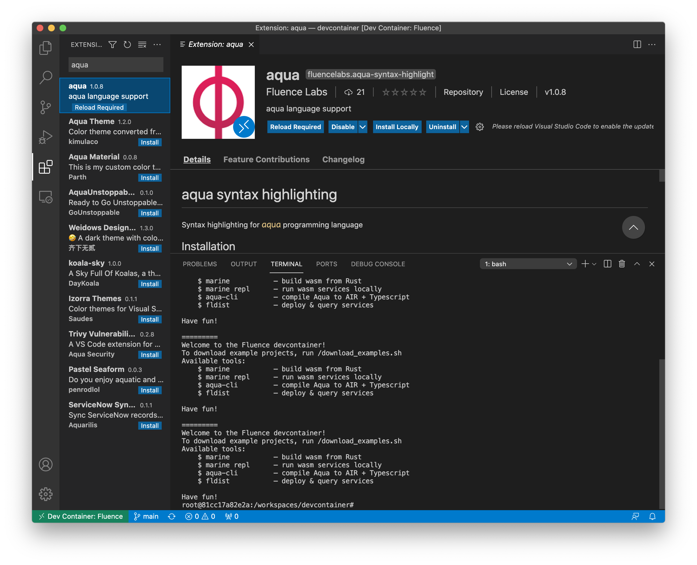

# Installation

Both the Aqua compiler and support library can be installed natively with `npm`

To install the compiler:

```bash
npm -g install @fluencelabs/aqua-cli
```

and to make the Aqua library available to Typescript applications:

```bash
npm -g install @fluencelabs/aqua-lib
```

Moreover, a VSCode syntax-highlighting extension is available. In VSCode, click on the Extensions button, search for `aqua`and install the extension.




